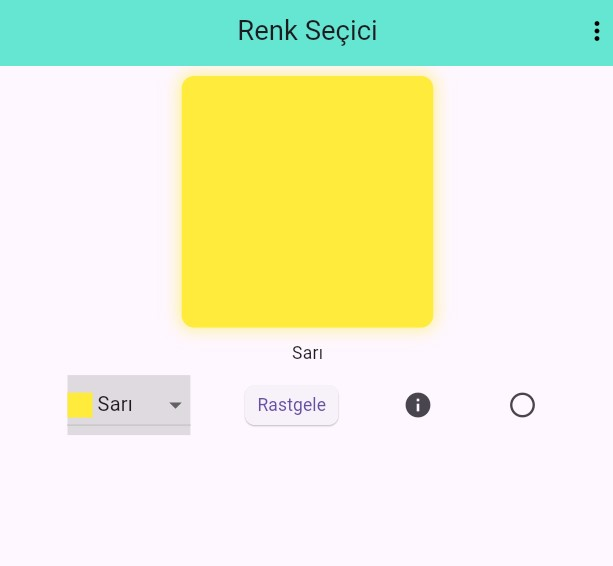

# Flutter ColorDisplay Widget

Bu proje, Flutter'da özelleştirilebilir ve duyarlı (responsive) bir renk görüntüleme bileşeni olan **ColorDisplay** widget'ını içerir. Bu bileşen, seçilen bir rengi ekran boyutuna göre dinamik olarak boyutlandırarak şık bir kutu veya daire şeklinde sunar.

## Özellikler

* **Responsive Boyutlandırma:** `MediaQuery` kullanarak ekranın en kısa kenarına (`shortestSide`) göre otomatik boyutlanır.
* **Dinamik Şekil:** `isCircular` parametresi ile tek bir dokunuşla kare (yuvarlatılmış köşeli) veya tam daire görünümüne geçebilir.
* **Gölge Efekti:** Seçilen rengin opaklığına göre (`withOpacity`) otomatik olarak senkronize olan yumuşak bir gölge (`BoxShadow`) ekler.
* **Hata Ayıklama:** Cihaz ve konteyner boyutlarını terminalde (`debugPrint`) takip etmenizi sağlar.


## Ekran Görüntüsü

| Uygulama Görüntüsü |
| :---: |
|  |


## Kod Yapısı

Widget iki temel parametre alır:
1. `selectedColor`: Görüntülenecek ana renk.
2. `isCircular`: `true` ise daire, `false` ise 10px yuvarlatılmış köşeli kare oluşturur.

```dart
ColorDisplay(
  selectedColor: Colors.blue,
  isCircular: true,
)

